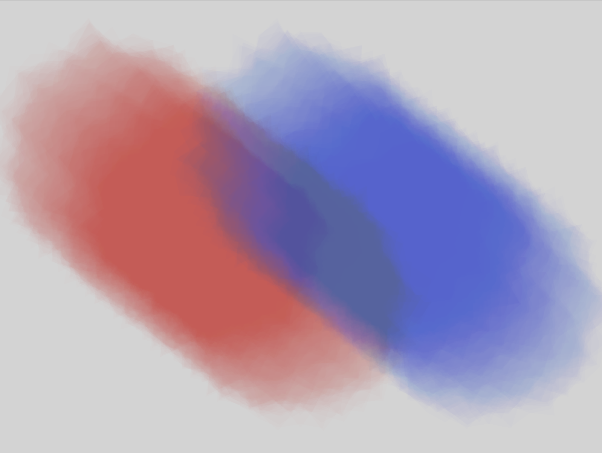
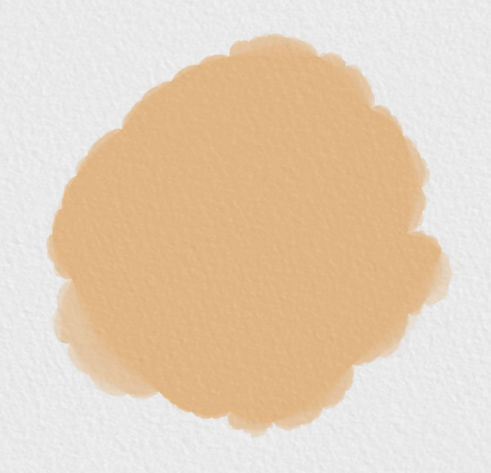

# lyin0616_9103_tut1
## Quiz 8
### Part 1: Imaging Technique Inspiration 

The watercolor effects of these examples could be incorporated into my project. Watercolor effect is also a painting feature of artworks. Most of the artworks in the assignment requirements use the texture of oil painting. Although there are some differences between watercolor and oil painting texture in painting methods and final effects, they also have similarities:
- the use of drawing functions
- color and transparency controls
- blending modes
- texture mapping

From the process of achieving watercolor effects, we can learn how to adjust and combine these elements to get the desired visual effect.

### Part 2: Coding Technique Exploration
Based on the code of this watercolor effect, the oil painting texture is achieved by changing the color mode to RGB, using a fixed oil painting color, setting the transparency to 1, and using ellipses or rectangles instead of polygons. The ellipse() or rect() functions can simulate the stroke effect of an oil painting. Adjusting the number of strokes, size, color and other parameters can obtain different oil painting effects.

[Watercolour Brushstrokes Video](https://www.youtube.com/watch?v=smO_u27QRK0&t=25s)

[Watercolour Brushstrokes Code](https://openprocessing.org/sketch/1009901)

[Simulating Water Colour Paint in P5js Video](https://www.youtube.com/watch?v=olXv8GOfpNw&t=0s)

[Simulating Water Colour Paint in P5js Code](https://editor.p5js.org/BarneyCodes/sketches/QAEms_Oh8)

  

